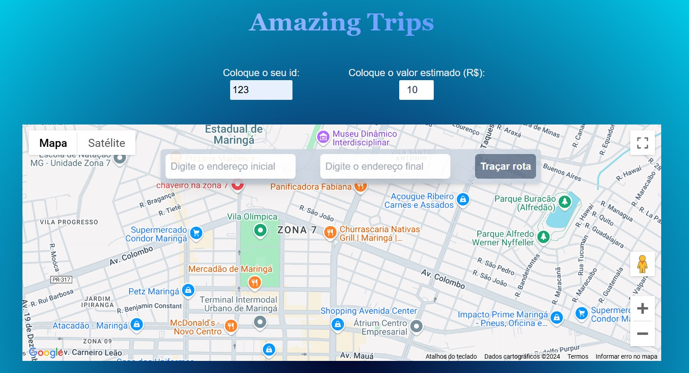

# Amazing Trips - Projeto para simular aplicação web de Taxi e Uber

Projeto FullStack desenvolvido com:

- Front-End: Next.js
- Back-End: Node.js
- Banco de Dados: MySQL
- Docker
- API do Google Maps

## Rodar o projeto

É necessário ter instalado o Docker na máquina e rodar o seguinte comando:
`docker-compose up --build`

Depois é só aproveitar e curtir a aplicação!
